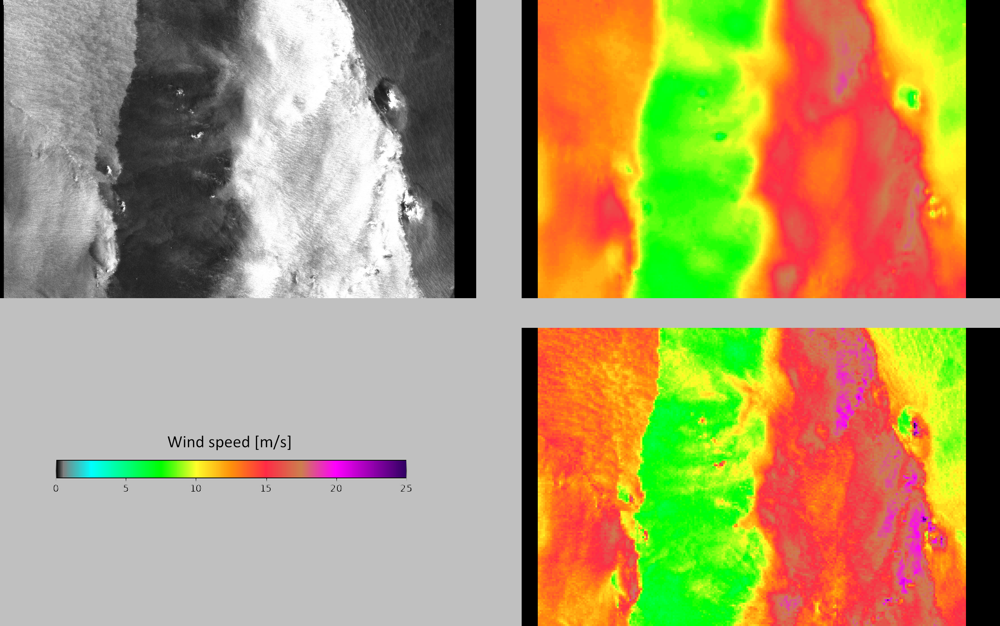

# Related Paper

MediSAR : [PAPER IN PREPARATION]

[Rainfall Estimation with SAR using NEXRAD collocations with Convolutional Neural Networks](https://arxiv.org/abs/2207.07333)

[Reduction of rain-induced errors for wind speed estimation on SAR observations using convolutional neural networks](https://arxiv.org/abs/2303.09200)

## Table of Content

- [Table of Content](#table-of-content)
- [Links to data](#links-to-data)
- [Summary](#summary)
- [Content](#content)
    - [SAR Observations](#sar-observations)
    - [Rain Estimation](#rain-estimation)
    - [Biological Slicks](#biological-slicks)
    - [Convective Cells](#convective-cells)
    - [SAR-based wind speed](#sar-based-wind-speed)
- [Notebooks](#notebooks)
- [Changelog](#changelog)
- [Roadmap](#roadmap)

## Links to data

- [MediSAR Gibraltar Toy Subset](https://www.kaggle.com/rignak/medisarsubset)
- [MediSAR-2014](https://www.kaggle.com/rignak/medisar2014)
- [MediSAR-2015](https://www.kaggle.com/rignak/medisar2015)
- [MediSAR-2016](https://www.kaggle.com/rignak/medisar2016)
- [MediSAR-2017](https://www.kaggle.com/rignak/medisar2017)
- [MediSAR-2018](https://www.kaggle.com/rignak/medisar2018)
- [MediSAR-2019](https://www.kaggle.com/rignak/medisar2019)
- [MediSAR-2020](https://www.kaggle.com/rignak/medisar2020)
- [MediSAR-2021](https://www.kaggle.com/rignak/medisar2021)
- [MediSAR-2022](https://www.kaggle.com/rignak/medisar2022)
- [MSG/SEVIRI collocations](https://www.kaggle.com/datasets/rignak/medisar-seviri) - INCOMPLETE
- [Sentinel-3/OLCI](https://www.kaggle.com/datasets/rignak/medisar-olci)

## Summary

MediSAR is a extensive dataset of Synthetic Aperture Radar (SAR) observations of the Mediterranean Sea. It contains all the Interferometric Wide (IW) observations acquired by the Sentinel-1 satellites from the ESA mission Copernicus.

SAR observation are affected by the sea surface roughness. Several meteorological and oceanic processes impact this sea surface roughness: it increases with the wind speed or the hydrometeors, but decrease in presence of biological surfactant such as oil pollution or biofilm. Therefore, it is possible to infer these processes from the SAR observation.

## Content

This dataset contains data from 2014 to 2022, both included. Due to size limitation, a kaggle dataset is provided for each year. Each IW product is contains in a folder `{YYYY}/{YYYY}-{MM}-{DD}/{YYYY}{MM}{DD}t{hh}{mm}{ss}`. These folders contains:

- The SAR observations of co- (vv) and cross- (vh) polarization channels. Downscaled at 200 m/px and stored as uint16.
- The rain estimation, as four-class segmentation roughly based on 1 mm/h, 3 mm/h and 10 mm/h. There are stored at 400 m/px on four channels, the transparency corresponding to the land mask.
- The biological slicks, as a uint8 image at 100 m/px. For compression, they are quantized to 3 bits per pixel.
- The convective cells, as a uint8 image at 200 m/px. For compression, they are quantized to 3 bits per pixel.
- SAR-based wind speed obtained either from Geophysical Model Function, a rainfall-resilient deep learning model and ERA5. They are provided at 1 km/px. The GMF from level-2 product is also included. Both are stored as uint8 images, quantized between 0 and 25.6 m/s. In case of higher wind speeds, 
- Land masks at 200 m/px.
- Collocations with MSG/SEVIRI (brightness temperature) and Sentinel-3/OLCI (chlorophyll concentration).

### SAR Observations

#### 20170421t181750

### Rain Estimation

#### 20171229t163858

### Biological Slicks

#### 20170316t172911

### Convective Cells

#### 20171218t044059

### SAR-based wind speed

#### 20211207t155813

## Notebooks

- [Use the metadata to get lat/lon coordinates](notebooks/use_metadata.ipynb)

- [Compare wind speed distribution from the Geophysical Model and the Deep Learning Rain-Invariant.](https://www.kaggle.com/code/rignak/deep-learning-wind-speed-vs-gmf-2021)

- [Slicks, convection and rain examples from 2021](https://www.kaggle.com/code/rignak/slicks-convection-rain-2021)

- [OLCI Examples](https://www.kaggle.com/code/rignak/medisar-olci-examples)

## Changelog

- **2023-03-21:** Add Sentinel-3/OLCI data.
- **2023-02-15:** Add incidence angle, interpolated ERA5 wind speed, aggregation maps.
- **2023-01-30:** Readme bugfix.
- **2023-01-29:** Release V1. Add years 2014 & 2022. Add wind speeds from L2 OCN and deep learning model..
- **2023-01-08:** Add years 2016, 2017, 2018 & 2021.
- **2023-01-02:** Add years 2019 & 2020.
- **2023-01-01:** First upload. 

## Roadmap

- Finish the MSG/SEVIRI collocations for brightness temperature.

- Redo the VH quicklooks (GMF change).

- Publish the paper.